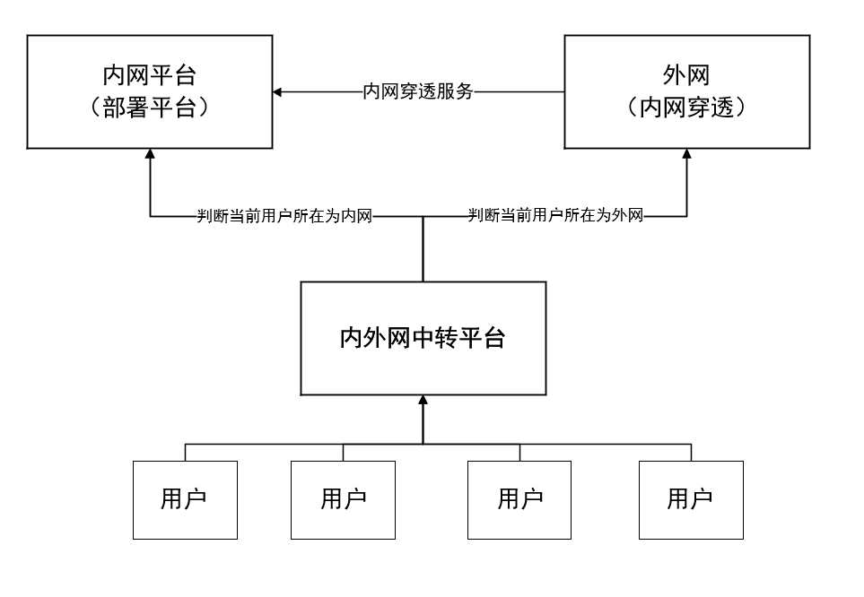

##  内外网统一跳转平台

展示界面：

###  1. 项目来源
本人在校园网内网中构建了一个公共文件共享服务，在内网中可以正常访问。由于寒假放假回家，需要在外网中访问校园内网中的文件共享服务，于是使用内网穿透服务实现外网的访问。

但内网与外网的访问域名是不同的，同时记忆不同的域名也不方便，于是想到了使用一个统一的跳转平台，实现内外网的统一跳转。

本项目由此产生。

###  2. 项目功能
本项目实现了内外网的统一跳转，实现了内外网的统一访问。

通过访问一个统一的域名地址，由web平台自行判断当前的网络类型（是处于校园内网还是外网），然后根据不同的网络类型，跳转到不同的域名。

###  3. 项目实现
本项目使用 jquery 中的 **图片** 的 load 方法来判断当前网络类型，通过判断图片是否加载成功来判断当前网络类型。

首先在内网中部署一个可以通过内网ip访问的图片。

然后在外网中部署本中转平台（仅一个html文件），当用户通过域名访问部署的中转平台时，若能成功加载到内网图片，则说明用户当前处于内网，程序将自动跳转到内网的服务中；否则，说明用户当前处于外网，程序将自动跳转到外网的服务中。

